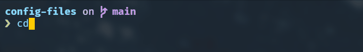

# Powershell

## 1. Creating Powershell profile

### Check if profile exists

If you are not sure whether you already have profile or not:
```
test-path $profile
```

### Create profile

```
New-Item –Path $Profile –Type File –Force
```

## 2. Install dependencies 

I use following additional packages. Follow the links and install by any method you like: 

1. [Get-ChildItemColor](https://github.com/joonro/Get-ChildItemColor) for colorized output
2. [Starship](https://starship.rs/) The minimal, blazing-fast, and infinitely customizable prompt for any shell.

>[Post-Git](https://github.com/dahlbyk/posh-git) is another great option for showing git info
## 3. Edit profile 

Open profile with any editor
```
code $PROFILE
```

## 4. Setting explanaiton
 

### Shows navigable menu of all options when hitting Tab
```
Set-PSReadlineKeyHandler -Key Tab -Function MenuComplete
```

### Autocompletion for arrow keys




```
Set-PSReadlineKeyHandler -Key UpArrow -Function HistorySearchBackward

Set-PSReadlineKeyHandler -Key DownArrow -Function HistorySearchForward
```

### Connect *Get-ChildItemColor*


```
If (-Not (Test-Path Variable:PSise)) {
    # Only run this in the console and not in the ISE
    Import-Module Get-ChildItemColor

    Set-Alias l Get-ChildItem -option AllScope
}
```

### Init *Starship* in the end
```
#Init starship
Invoke-Expression (&starship init powershell)
```

## Notes

* You can see different profiles locations using
    ```
    $profile | select *
    ```

* If you want to make quick navigation aliases like in bash you need to make function because powershell aliases do not support parameters
    ```
    function srs  { set-location "D:\source\repos\"}
    ```